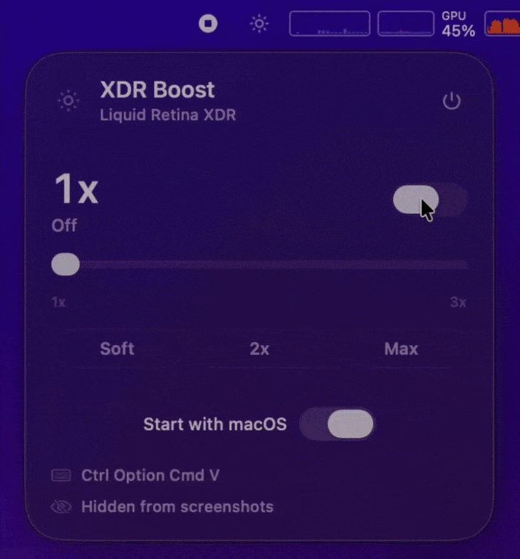

# Sunray XDR

<p align="center">
  
</p>

Sunray XDR is a polished macOS app fork of [levelsio/xdr-boost](https://github.com/levelsio/xdr-boost), adding a Liquid Glass menu bar UI, brightness slider, presets, launch-at-login, app icon, packaged builds, and visual polish for everyday users.

Original concept and core XDR overlay technique by [Pieter Levels](https://github.com/levelsio). This fork keeps the spirit of the original tiny utility and turns it into a friendlier native Mac app.

## Features

- Boosts screen brightness beyond the standard 500 nit SDR limit using XDR hardware
- No white tint or washed-out colors; uses multiply compositing to preserve colors
- Native Liquid Glass menu bar panel on macOS 26+
- Live brightness slider with a safe 1x-3x range
- Quick presets for Soft, 2x, and Max
- Animated sun menu bar icon that reflects the current boost level
- Subtle panel glow and sun-ray atmosphere when XDR is active
- Saves your preferred boost level between launches
- Global keyboard shortcut: **Ctrl+Option+Cmd+V**
- Optional start with macOS
- Survives sleep/wake, lid close/open, lock/unlock, and display changes
- Starts with XDR off so rebooting always gives you a normal screen
- Emergency kill switch: `sunray-xdr --kill`
- Single native Swift app, no dependencies

## How It Works

MacBook Pro displays can output up to 1600 nits, but macOS caps regular desktop content at about 500 nits. The extra brightness is reserved for HDR content.

Sunray XDR creates an invisible Metal overlay using `multiply` compositing with EDR (Extended Dynamic Range) values above 1.0. This triggers the display hardware to boost its backlight, making everything brighter while preserving colors.

## Requirements

- MacBook Pro with Liquid Retina XDR display (M1 Pro/Max or later)
- macOS 12.0+
- macOS 26+ for the full Liquid Glass panel effect

## Install

### Easy Install

Download the latest `.dmg` from [Releases](https://github.com/0Synce/sunray-xdr/releases), open it, and drag **Sunray XDR.app** to Applications.

If you prefer building from source, download the repository and double-click `Install.command`.

The installer builds Sunray XDR, copies it to `/Applications/Sunray XDR.app`, verifies the app signature, and opens it.

### Build A DMG

```bash
make dmg
```

The packaged DMG will be created in `dist/`.

### Manual Install

```bash
git clone https://github.com/0Synce/sunray-xdr.git
cd sunray-xdr
./install.sh
```

The built app will also be available at `.build/Sunray XDR.app`.

### Command-Line Binary

```bash
make build
```

The binary will be at `.build/sunray-xdr`.

### Install To PATH

```bash
sudo make install
```

### Start On Login

Use the **Start with macOS** toggle in the app, or:

```bash
sudo make install
make launch-agent
```

### Uninstall

```bash
make remove-agent
sudo make uninstall
```

## Usage

```bash
# Run the macOS app
open ".build/Sunray XDR.app"

# Or run the command-line binary with menu bar icon
sunray-xdr

# Run with custom boost level
sunray-xdr 2.5
```

Click the sun icon in your menu bar to:

- Toggle XDR brightness on/off
- Fine-tune brightness with the slider
- Choose quick presets
- Enable start with macOS
- Quit

### Keyboard Shortcut

**Ctrl+Option+Cmd+V** toggles XDR brightness on/off from anywhere.

### Emergency Kill

If something goes wrong and you cannot see your screen:

```bash
sunray-xdr --kill
```

The kill switch also looks for older `xdr-boost` process names for compatibility.

## Sleep, Lid Close, And Lock Screen

A common problem with XDR brightness apps is that closing your laptop or locking the screen kills the brightness boost, and it does not come back when you return. Sunray XDR uses a watchdog to automatically restore brightness after:

- Closing and reopening the laptop lid
- Locking and unlocking the screen
- Sleep and wake
- Plugging or unplugging external displays
- Mission Control / Space changes

If you turned XDR on, it stays on.

## Credits

Sunray XDR is based on [levelsio/xdr-boost](https://github.com/levelsio/xdr-boost).

Original concept and core XDR overlay technique by [Pieter Levels](https://github.com/levelsio). This fork adds the native macOS app experience, Liquid Glass UI, slider, presets, start-at-login support, packaging, icon, and visual refinements.

## License

MIT. See [LICENSE](LICENSE).
